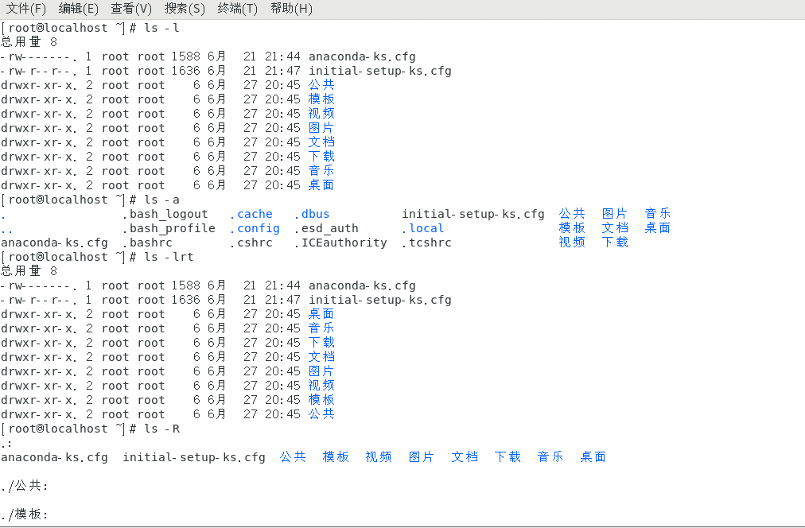

# 文件管理
## 创建和删除
* __pwd__ 显示当前的目录名称
* __cd__ 更改当前的操作目录
    * cd /path/to/... 绝对路径
    * cd ./path/to/... 相对路径
    * cd ../path/to/... 相对路径
    * 目录补全：Tab
    * cd - 回到刚才目录
    * 
* __ls__ 查看当前目录下的文件
    * ls [选项，选项...] 参数...
    * 常用参数：
        * __-l__ 长格式显示文件
        * __-a__ 显示隐藏文件
        * __-r__ 逆序显示
        * __-t__ 按照时间顺序显示
        * __-R__ 递归显示
        ```
        # 显示根目录和root目录下所有文件
        ls /root /
        ```
        
* __mkdir__ 建立目录
    * -p
    ```
    mkdir -p /a/b/c/d/e
    ls -R /a
    ```
* __rmdir__ 删除目录（只能删除空白的目录）
* __rm -r__ 删除目录（可删除非空目录，有删除确认提示）
* __rm -rf__ 删除目录（可删除非空目录，无删除确认提示）
* __touch__ 创建空文件

## 复制和移动
* __cp__ 复制文件
    ```
    cp 要复制的源文件目录A 要复制的目的文件目录B #把A复制到B
    ```
    * __cp -v__ 显示复制过程（进度）
    * __cp -p__ 保留原文件的建立时间属主信息
    * __cp -a__ 权限，时间，属主
    * __cp -r__ 复制目录
  * __mv__
    * 重命名
    ```
    mv /filea /fileb  # 将 filea 重命名成 fileb
    ```
    * 移动
    ```
    mv /fileb /tmp # 将 fileb 移动至 tmp 目录下
    ```
    * 移动同时重命名
    ```
    mv /tmp/fileb /filec
    ```
    * 通配符
        * __*__
        ```
        touch filea fileb filec fileabc
        cp -v file* / # 匹配文件名：以 “file” 开头后面任意长度任意内容 复制到根目录下
        ls file* # 列出...
        ```
        * __?__
        ```
        touch filea fileb filec fileabc
        cp -v file? / # 匹配文件名：以 “file” 开头后面1个长度任意内容 复制到根目录下
        ls file？ # 列出...
        ```
    | 字符 | 含义 |
    | ----- | ----- |
    | *	    |匹配 0 或多个字符 |
    |  ?    | 匹配任意一个字符 |
    | [list] | 匹配 list 中的任意单一字符 |
    | [^list]| 匹配 除 list 中的任意单一字符以外的字符 |
    | [c1-c2] | 匹配 c1-c2 中的任意单一字符 如：[0-9][a-z] |
    | {string1,string2,...} | 匹配 string1 或 string2 (或更多)其一字符串 |
    | {c1..c2} | 匹配 c1-c2 中全部字符 如{1..10} |