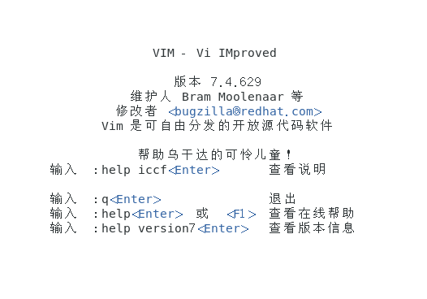

# Vim
* 多模式产生的原因
* 四种模式
    * 正常模式（Normal-mode）n
    * 插入模式（Insert-mode）i
    * 命令模式（Command-mode）c
    * 可视模式（Visual-mode）v
  
* 打开：
```
vim
```


## 插入模式
* i进入插入模式
* I进去插入模式并且光标到当前行开头
* a进去插入模式并且光标到当前光标的下一位
* A进去插入模式并且光标到当前行的末尾
* o进去插入模式并且光标到当前光标的下一行产生空行
* O进入插入模式并且光标到当前行的上一行产生空行

## :表示末行模式

## 正常模式
* 四个方向hjkl
    * h 左
    * l 右
    * j 下
    * k 上
* 复制，粘贴
    * yy 复制单行 p 粘贴单行 3p 粘贴3行
    * 3yy 复制3行（当前行往下三行，包括当前行）
    * y$ 复制当前光标位置到这一行的结尾字符
    * dd 剪切一整行
    * d$ 剪切当前位置到这一行的结尾
    * u 普通模式下，撤销 ，多次u多次撤销
    * u ctrl +r 重做，返回上一次撤销，相当于win的ctrl+y
    * x 删除指定字符，光标选中，按x
    * r+新字符 字符替换，光标选中按r 在输入新字符
* 移动
    * G 移动到指定行
    * :set nu 查看当前行
    * 11G 移动到第11行
    * g 移动到第一行
    * G移动到最后一行
    * ^ 表示到这一行的开头
    * $ 表示到这一行的结尾（用于一行太长的情景）
  
  ## 命令模式
* :w +文件名 保存到指定文件名中，不接文件名表示保存到原始文件当中
* :q 退出
* :q! 强制退出
* :wq! 强制写入退出
* :! +功能命令 如:! ipconfig ，表示临时查看命令
* / +字符 表示查找某个字符 n向下移动查找 shift n向上移动查找

* :s/old/new 替换字符，默认表示所在行范围进行替换，整个文件范围替换使用:%s/old/new/g
    * (g 表示全局)在指定范围替换使用 :起始行，结束行s/old/new/g(多次替换加/g，单次则不需要)
* :set +命令 表示单次修改设置生效，如 nu , nonu，设置永久生效则需要去配置文件（/etc/vimrc）中添加 set nu的配置

## 可视模式
* v 表示字符可视模式，以字符为单位选择
* V 表示行可视模式，以行为单位选择
* ctrl+v 块可视模式，块插入：光标选中多行后按大写I，然后输入内容，再按两次ESC，块删除同理，ctrl+v 进入可视模式，光标选中多行，按d进行删除