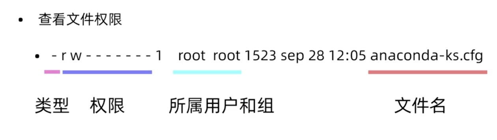
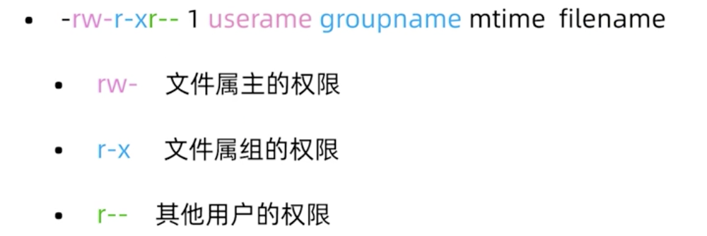

# 用户与权限管理
## 用户管理常用命令 (切换成root身份之后执行)
* __useradd__ 新建用户
    ```
    useradd wilson

    / # 家目录:
    ls -a /home/wilson

    / # etc/passwd
    tail -10 /etc/passwd

    / # etc/shadow 用户密码相关文件
    tail -10 /etc/shadow

    / # 分配uid
    / # 分配组gid（没用指定用户组的话默认分配与用户名同名的用户组）
    ```
* __id__ 查看用户是否存在
    ```
    id root

    / # root的uid = 0
    id root
    ```
* __userdel__ 删除用户
    ```
    userdel wilson
    ```
    * __-r__ 选项：彻底删除（包括家目录，设定文件（passwd，shadow）等）
    ```
    userdel -r wilson
    ```
* __passwd__ 修改用户密码
    ```
    / # 更改其他用户（wilson）的密码
    passwd wilson

    / # 更改自己的密码
    passwd
    ```
* __usermod__ 修改用户属性
    ```
    / # 修改用户家目录
    usermod -d /home/wilson1 wilson

    / # 修改用户组
    usermod -g group1 wilson
    ```
* __chage__ 修改用户属性

## 组管理命令
* __groupadd__ 新建用户组
    ```
    / # 新建用户组
    groupadd group1

    / # 新建用户并加入用户组
    useradd -g group1 user2
    ```
* __groupdel__ 删除用户组

## 用户身份切换
### 切换用户 (使用 login shell 方式切换用户)
* __su__ 不完全切换
    ```
    / # 将当前身份从 root 切换至 user1 （不完全切换：运行时环境保持不变）切换后仍在 root 家目录，但无访问权限
    su user2
    pwd
    ls
    ```
* __su -__ 完全切换 （推荐）
    ```
    / # 将当前身份从 root 切换至 user1 （完全切换：运行时环境也一并切换）切换后在 user1 的家目录
    su - user1
    pwd
    ```
* root 切换成普通用户无需密码，普通用户切换成其他普通用户或切换成 root 需要密码
### 以其他用户身份执行命令 （以自己但身份执行其他身份用户的指令）
（不报漏自己密码给其他用户授权）
* __sudo__ 执行命令
* __visudo__ 赋予用户命令权限
> 场景：root 希望在30分钟之内关闭 Linux 操作系统,普通用户来取消关闭
```
/ # root 执行：
shutdown -h 30
```
1. root 将shutdown -c 命令权限赋予 user3:
    ```
    visudo

    / # 将shutdown -c 命令权限赋予 user3:
    user3 ALL=/sbin/shutdown -c
    :wq

    / # 查看shutdown 命令位置：
    :!which shutdown

    ```
2. user3 使用 sudo 执行命令
    ```
    sudo /sbin/shutdown -c
    ```

## 用户与用户组的配置文件（字段解释）
* passwd
    ```
    / # 打开
    vim /etc/passwd

    / # 用户名称：是否需要密码验证登录：uid：gid：注释：用户家目录位置：用户登录命令解释器

    / # /sbin/nologin : 不能登录
    ```
* shadow 保存用户和用户密码相关信息
    ```
    / # 打开
    vim /etc/shadow

    / # 用户名称：用户加密过的密码（$6$...）
    ```
* group
    ```
    / # 打开
    vim /etc/group

    / # 组名称：组是否需要密码验证：gid：其他组设置
    ```

## 文件权限

* 文件类型
    * - 普通文件
    * d 目录文件
    * b 块特殊文件
    * c 字符特殊文件（设备）
    * l 符号链接
    * f 命名管道
    * s 套接字文件
* 文件权限的表示方法（普通文件）
    * 字符权限表示方法
        * r 读
        * w 写
        * x 执行
    * 数字权限的表示方法
        * r = 4 
        * w = 2
        * x = 1
    * 创建新文件有默认权限，根据 umask 值计算，属主和属组根据当前进程的用户来设定
  
* 文件权限的表示方法（目录）
    * x 进入目录
    * rx 显示目录内的文件名
    * wx 修改目录内的文件名（删除）
  
## 修改权限命令
* chmod 修改文件，目录权限
    * chmod u+x /tmp/testfile 
        * u 属主 u+ u- u=rwx
        ```
        - # 新建文件
        touch afile

        - # 增加执行权限
        chmod u+x afile
        ```
        * g 属组
        ```
        - # 减少读权限
        chmod g-r afile
        ```
        * o  其他位置（用户）
        ```
        - # 增加w减少r（将读权限改为写权限）
        chmod o=w afile
        ```
        * a 所有（ugo）
        ```
        - # 属主属组其他位置都有可读权限
        chmod a+r afile
        ```
    * chmod 755 /tmp/testfile （创建普通文件权限默认644=666-022，Max：777）
    ```
    - # 属主只读4 属组只读4 其他位置读4+写2
    chmod 446 afile
    ```
* chown 更改属主，属组
    ```
    - # root 身份新建目录
    mkdir /test

    - # 更改属主
    chown user1 /test

    - # 更改属组
    chown :group1 /test
    - # or
    chgrp user3 /test
    ```
* chgrp 可以单独更改属组，不常用
    ```
    chgrp user3 /test
    ```

## 特殊权限
* SUID 用于二进制可执行文件，执行命令时取得文件属主权限
    * 例： /usr/bin/passwd
    ```
    - # 4 + 对应权限
    chmod 4755 /test/afile
    ```
* SGID 用于目录，在该目录下创建新的文件和目录，权限自动更改为该目录的属组
* SBIT 用于目录，该目录下新建的文件和目录，仅root和自己可以删除
    * 例： /tmp
    ```
    - # 1 + 对应权限
    chmod 1777 /test
    ```

## 验证（略）
* 权限冲突时 属主权限优先
```
echo 123 > afile
```
