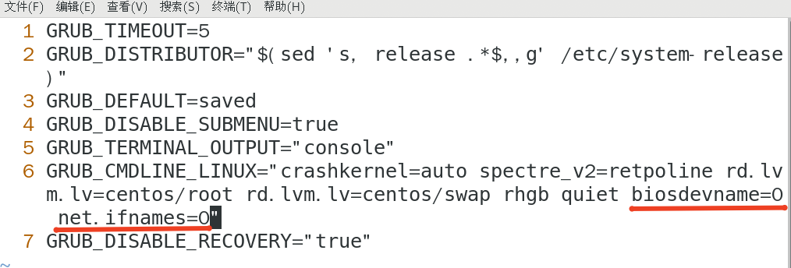
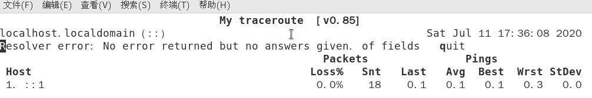

# 网络管理
* 网络状态查看
* 网络配置
* 路由命令
* 网络故障排除
* 网络服务管理
* 常用网络配置文件

## 网络状态查看工具
1. net-tools （centos7以前）
   * ifconfig
   * route
   * netstat
2. iproute2 （centos7以后）
   * ip
   * ss
  
## 网络状态查看命令
__ifconfig__ (普通用户：/sbin/ifconfig)
  * eth0 第一块网卡（网络接口）
  * 你的第一个网络接口可能叫做下面的名字
    * eno1 板载网卡
    * ens33 PCI-E网卡
    * enp0s3 无法获取物理信息的 PCI-E 网卡
    * CentOS7 使用了一致性网络设备命名，以上都不匹配则使用 eth0

## 网络接口命名修改 => eth0
* 网卡命名规则受 biosdevname 和 net.ifnames 两个参数影响
* 编辑 /etc/default/grub 文件，增加 biosdevname = 0 net.ifnames = 0
* 更新 grub
  * ```# grub2-mkconfig -o /boot/grub2/grub.cfg```
* 重启
  * ``` # reboot ```
    |      | biosdevname | net.ifnames | 网卡名 |
    | ---- | ---- | ---- | ---- |
    |默认|0|1|ens33|
    |组合1|1|0|em1|
    |组合2|0|0|eth0|
    ```
    # vim /etc/default/grub
    ```

     

    ```
    # grub2-mkconfig -o /boot/grub2/grub.cfg
    # reboot
    ```

## 查看网络情况
* 查看网卡物理连接情况
  * mii-tool eth0
  
## 查看网关命令
* 查看网关
  * route -n
  * 使用 -n 参数不解析主机名

## 网络配置命令
* ifconfig<接口> < IP地址> [netmask 子网掩码] 设置ip地址
* ifup<接口> 启动网卡
* ifdown<接口> 关闭网卡

## 网关配置命令
* 添加网关
  * route add default gw<网关ip>
  * route add -host<指定ip> gw<网关ip>
  * route add -net<指定网段>netmask<子网掩码> gw<网关ip>
  
## 网络命令集合：ip命令
* ip addr ls
  * ifconfig
* ip link set dev eth0 up
  * ifup eth0
* ip addr add 10.0.0.1/24 dev eth1
  * ifconfig eth1 10.0.0.1 netmask 255.255.255.0
* ip route add 10.0.0/24 via 192.168.0.1
  * route add -net 10.0.0.0 metmask 255.255.255.0 gw 192.168.0.1
  ```
  # 修改路由（删除再添加）
  route del default gw 10.211.55.1
  route add default gw 10.211.55.2

  # 明细路由（访问10.0.0.1时通过网关10.211.55.1出去）
  route add -host 10.0.0.1 gw 10.211.55.1

  # 设定网段的明细路由
  route add -net 192.168.0.0 netmask 255.255.255.0 gw 10.211.55.3
  ```

## 网络故障排除命令
* ping
* traceroute
* mtr
* nslookup 将域名解析成ip地址
* telnet 端口检查
* tcpdump 网络抓包工具
* netstat 对外服务的监听地址
* ss
  ```
  # # # ping
  ping www.baidu.com
  
  # # # traceroute
  traceroute -w 1 www.baidu.com #如果有延迟最多等待1秒钟

  # # # mtr
  mtr

  # # # nslookup
  nslookup www.baidu.com

  # # # telnet
  yum install telnet -y
  telnet www.baidu.com 80
  ^]
  (quit)

  # # # tcpdump
  # port
  tcpdump -i any -n port 80 # 抓取任意网卡，（-n）并解析成ip的形式（不要域名） 只抓取 80 端口
  # host
  tcpdump -i any -n host 10.0.0.1
  # host and port
  tcpdump -i any -n host 10.0.0.1 and port 80
  # 捕获并保存至文件
  tcpdump -i any -n host 10.0.0.1 and port 80 -w /tmp/filename

  # # # netstat
  netstat -ntpl # n:ip, t: tcp, p: 进程, l;listen
  ```

  * mtr:
   

  ## 网络管理和配置文件
  ### 网络服务管理
  * 网络服务管理程序分为两种，分别为SysV和systemd
    * service network start|stop|restart
    * chkconfig -list network
    * systemctl list-unit-files NetworkManager.service
    * systemctl start|stop|restart NetworkManager
    * systemctl enable|disable NetworkManager
  ### 网络配置文件
    * ifcfg-eth0 网卡配置文件（随网卡名而定）/etc/sysconfig/network-scripts/
    * /etc/hosts 控制网络常用参数
  
  ```
  service network status
  service network restart
  systemctl list-unit-files NetowrkManager.service

  # 设置使用Manager
  chkconfig --list network
  # 禁用
  chkconfig --level 2345 network off
  # all off => manager接管

  # 禁用 systemctl 
  systemctl disable NetworkManager
  # 启用
  systemctl enable NetworkManager
  ```

  ```
  cd /etc/sysconfig/network-scripts/
  ls ifcfg-*
  vim ifcfg-eth0

  # 让设置生效
  service network restart
  # 让设置生效的另一种方式
  systemctl restart NetworkManager.service

  # 主机名
  hostname
  # 当时生效
  hostname c7.test11
  # 永久生效
  hostnamectl set-hostname c7.test11
  vim /etc/hosts
  (i:) 177.0.0.1 c7.test11
  ```

