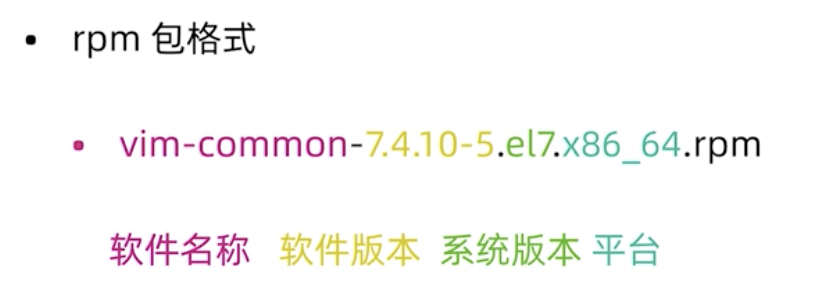
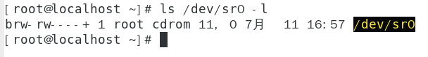

# 软件安装
* 软件包管理器
* rpm 包和 rpm 命令
* yum 仓库
* 源代码编译安装
* 内核升级
* grub配置文件
  
## 软件包管理器
* 包管理器是方便软件安装，卸载，解决软件依赖关系的重要工具
  * CentOS，RedHat 使用 yum 包管理器，软件安装包格式为 rpm
  * Debian，Ubuntu 使用 apt 包管理器，软件安装包格式为 deb

### rpm 包
  
* 前置知识
  ```
  # 查看设备（光驱，移动硬盘）
  ls /dev -l # 以“c”开头的是字符设备，以“d”开头的是块设备（光驱）

  # 查看光驱
  ls /dev/sr0 -l
  ```
   

  ```
  # 将光盘做成光盘镜像
  dd if=/dev/sr0 of=/xxx/xx.iso
  ```

  * 挂载光盘
  ```
  mount /dev/sr0 /mnt
  cd /mnt
  ls
  ```
* rpm 命令
  * 常用参数
    * -q 查询软件包
    ```
    # 查看所有（a）
    rpm -qa
    # 分屏 （按空格键下一页）
    rpm -qa | more

    # 查看特定软件包（包名）
    rpm -q vim-common
    ```
    * -i 安装软件包
    ```
    # 依赖关系需要手动解决
    rpm -i vim-enhanced-7.4.629-6.el7.x86_64.rpm
    ```
    * -e 卸载软件包
    ```
    rpm -e vim-enhanced
    # 使用空格同时卸载多个软件包
    rmp -e vim-enhanced vim-common
    ```

### yum包管理器
* rpm包的问题
  * 需要自己解决依赖关系
  * 软件包来源不可靠
* CentOS yum 源
  * http://mirror.centos.org/centos/7/
* 国内镜像
  * https://opsx.alibaba.com/mirror

#### 
* yum 配置文件
  * /etc/yum.repos.d/CentOS-Base.repo
  * wget -O /etc/yum.repos.d/CentOS-Base.repo
    * http://mirror.aliyun.com/repo/Centos-7.repo

#### 
* yum 命令常用选项
  * install 安装软件包
    ```
    yum install vim-enhanced
    ```
  * remove 卸载软件包
    ```
    yum remove vim
    ```
  * list ｜ grouplist 查看软件包
    ```
    yum list
    ```
  * update 升级软件包
    ```
    yum update 软件包名

    # 升级所有软件包
    yum update
    ```

* 更改 yum 源
  * https://opsx.alibaba.com/mirror
  * （搬运）配置方法：
  1. 备份
   ```
   mv /etc/yum.repos.d/CentOS-Base.repo /etc/yum.repos.d/CentOS-Base.repo.backup
   ```
   1. 下载新的 CentOS-Base.repo 到 /etc/yum.repos.d/
   ```
   # CentOS 7
   wget -O /etc/yum.repos.d/CentOS-Base.repo https://mirrors.aliyun.com/repo/Centos-7.repo
   ```
   1. 运行 yum makecache 生成缓存
   ```
   yum makecache
   ```

### 其他方式安装
* 二进制安装
* 源代码编译安装
  * wget https://openresty.org/download/openresty-1.15.8.3.tar.gz
  * tar -zxf openresty-VERSION.tar.gz
  * cd openresty-VERSION/
  * ./configure --prefix=/usr/local/openresty
    ```
    # 如果没有安装gcc
    yum install gcc gcc-c++

    # requires the PCRE library.
    yum install pcre-devel

    # 重新执行
    ./configure --prefix=/usr/local/openresty

    # requires the OpenSSL library.
    yum install openssl-devel
    ``` 
  * make -j2 编译用两个逻辑CPU编译(gmake)
  * make install

# 内核升级
* rpm 格式内核
  * 查看内核版本
    * uname -r
  * 升级内核版本
    * yum install kernel-3.10.0
  * 升级已安装的其他软件包和补丁
    * yum update
## 源代码编译安装内核
* 安装依赖包
  ```
  yum install gcc gcc-c++ make ncurses-devel openssl-devel elfutils-libelf-devel
  ```
* 下载并解压缩内核
  * https;//www.kernel.org
  ```
  tar xvf linux-5.1...10.tar.xz -C /usr/src/kernels
  ```
* 配置内核编译参数
  * cd /usr/src/kernels/linux-5.1.10/
  * make menuconfig|allyesconfig|allnoconfig
* 使用当前系统内核配置
  ```
  cp /boot/config-kernelversion.platform /usr/src/kernels/linux-5.1.10/.config
  ```
* 查看 CPU
  ```
  lscpu
  ```
* 编译
  ```
  make -j2 all
  ```
* 安装内核
  ```
  make modules_install
  make install
  ```

```
yum install epel-release -y
yum install kernel
```

```
# 查看使用空间
df -h
```


