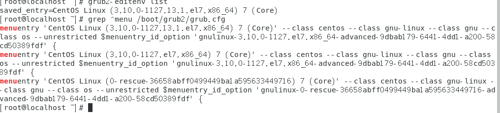
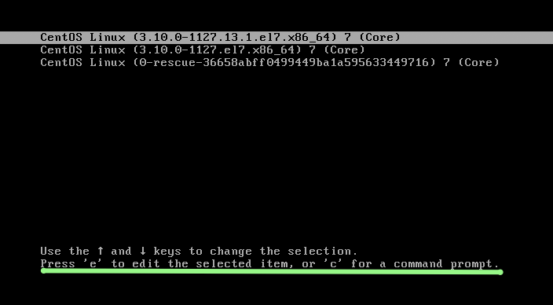

# grub 配置文件
* /etc/default/grub （基本配置）
* /etc/grub.d/ （更详细的配置）
* /boot/grub2/grub.cfg (grub配置位置，注意：不要直接编辑这个文件，会丢失)
* grub2-mkconfig -o /boot/grub2/grub.cfg （产生新的配置）

## 修改默认启动内核
```
# 查看当前启动内核
grub2-editenv list

# 查看已安装内核（使用grep过滤）
grep ^menu /boot/grub2/grub.cfg

# 设置默认启动内核(第一个)
grub2-set-default 0
```

 

## 内核时让内核打印更详细的信息（排除异常）
```
vim /etc/default/grub
```
> GRUB_CMDLINE_LINUX="rd.lvm.lv=centos/root rd.lvm.lv=centos/swap rhgb quiet biosde vname=0 net.ifnames=0"

去掉 “ __rhgb quiet__”

## 重置 root 密码

*  
* 按 “e” 键
* 找到 “linux16”那一行 添加设置项 single（CentOS7 ： rd.break）
* Ctrl + x 进入内存中的虚拟根目录 （真正的根目录在 /sysroot）
  * 将文件系统重新挂载
    ```
    # 挂载之后可读写（rw）
    mount -o remount,rw /sysroot
    ```
  * 修改根目录（将真正的根目录重新当成一个根目录）
    ```
    chroot /sysroot
    ```
  * 修改密码
    ```
    echo yournewpswd | passwd --stdin root
    ```
  * 关闭 SELinux
    ```
    vim /etc/selinux/config
    ```
    > SELINUX=enforcing
    改成
    > SELINUX=disabled
  * exit
  * reboot