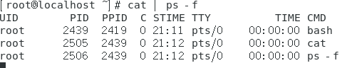
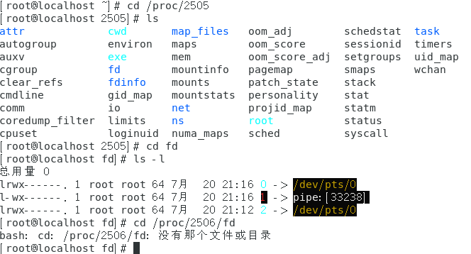

# 管道与重定向
* 管道与管道符
* 子进程与子shell
* 重定向符号

## 管道和管道符
* 管道和信号一样，也是进程通信对方式之一
* 匿名管道（管道符）是 Shell 编程常用到到通信工具
* 管道符是“｜”，将前一个命令执行到结果传递给后面到命令
  * ps | cat
  * echo 123 | ps
```
ls -l | more
more anaconda-ks.cfg
cat anaconda-ks.cfg | more

# 为外部命令建立子进程，并把两个子进程（第一个到输出，第二个的输入）建立连接
cat | ps -f
```
 

 ```
 cd /proc/2505
 ls
 cd fd
 ls -l
 # 0 -> 标准输入
 # 1 -> 标准输出

 # ps 命令执行完立即消失，所以没有2506
 cd /proc/2506/fd
 ```
 

## 重定向符号
* 一个进程默认会打开标准输入、标准输出、错误输出三个文件描述符
* 输入重定向符号 “<”
  * read var < /path/to/a/file
* 输出重定向符号 “>” “>>” “2>” “&>”
  * echo 123 > /path/to/a/file
  * “>” :输出到文件，输出前将文件内容清空
  * “>>” :输出到文件，append to next row
  * “2>” : 错误重定向
  * “&>” : 无论什么都输出
* 输入和输出重定向组合使用
  * cat > /path/to/a/file << EOF
  * I am $USER
  * EOF  

### 输入重定向
```
# wc : 统计输出的行数
wc -l
123
456
# Ctrl + d
-> 2

# 统计/etc/passwd的行数
wc -l < /etc/passwd

# 变量
read var
123
echo $var
-> 123

vim a.txt
-> 123 :wq
read var2 < a.txt
echo $var2
-> 123
```

### 输出重定向
```
echo $var2 > b.txt
cat b.txt
-> 123

nocmd 2> c.txt
cat c.txt

nocmd &> d.txt
cat d.txt
```

### 输入输出组合
```
# 通过 3.sh 生成 a.sh
vim 3.sh

#!/bin/bash
cat > /root/a.sh <<EOF
echo "hello bash"
EOF

bash 3.sh
cat a.sh
```
