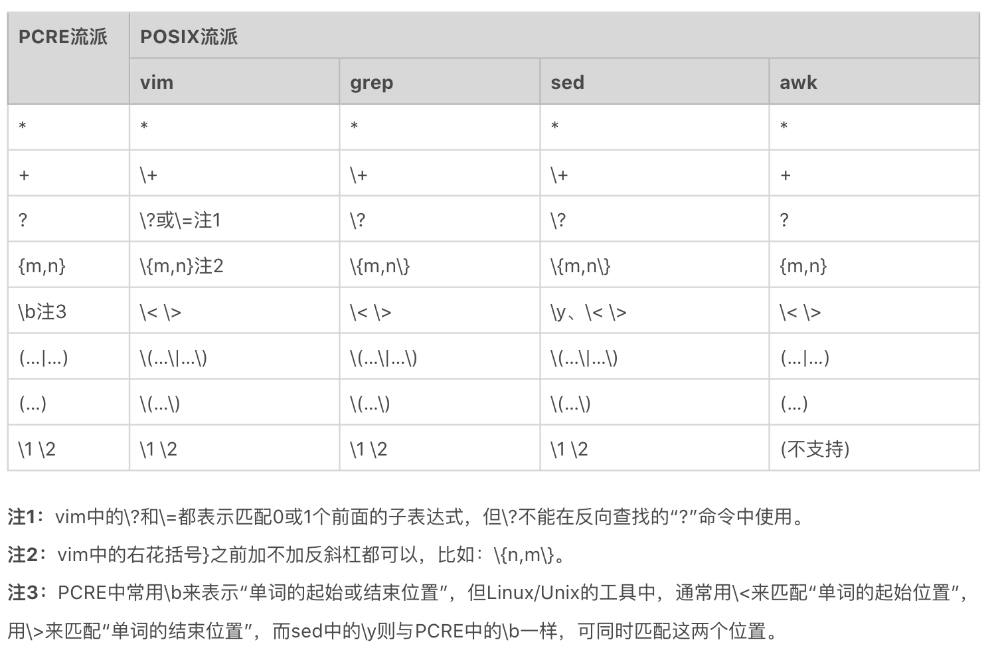

# regex
https://regex101.com/
> Some people, when confronted with a problem, think “I know, I’ll use regular expressions.” Now they have two problems.

# 正则元字符
## 特殊单字符
* ``` . ``` 任意字符（换行除外）
* ``` \d ``` 任意数字 ``` \D ``` 任意非数字
* ``` \w ``` 任意字母数字下划线 ``` \W ``` 任意非字母数字下划线
* ``` \s ``` 任意空白符 ``` \S ``` 任意非空白符

## 空白符
* ``` \r ``` 回车符
* ``` \n ``` 换行符
* ``` \f ``` 换页符
* ``` \t ``` 制表符
* ``` \v ``` 垂直制表符

## 范围
* ``` | ``` 或
* ``` [...] ``` 多选一，括号中任意单个元素
* ``` [a-z] ``` 匹配a到z之间任意单个元素
* ``` [^...] ``` 取反，不能是括号中的任意单个元素

## 量词
* ``` * ``` 0到多次
* ``` + ``` 1到多次
* ``` ? ``` 0到1次
* ``` {m} ``` 出现m次
* ``` {m,} ``` 出现至少m次
* ``` {m,n} ``` m到n次

# 贪婪、非贪婪与独占模式
### 量词
* ``` * ``` 0到多次
* ``` + ``` 1到多次
* ``` ? ``` 0到1次
* ``` {m} ``` 出现m次
* ``` {m,} ``` 出现至少m次
* ``` {m,n} ``` m到n次

## 贪婪匹配（Greedy）
* 表示次数的量词，默认是贪婪的，满足要求情况下，尽可能按最长去匹配
  * 回溯：后面匹配不上，会吐出已匹配的再尝试
## 非贪婪匹配（Lazy）
* “量词”元字符后加 ``` ? ``` 满足要求情况下，尽可能按最短去进行匹配
  * 回溯：后面匹配不上，会匹配更长再接着尝试
## 独占模式（Possessive）
* “量词”元字符后加 ``` + ``` 满足要求情况下，尽可能按最长去匹配
  * 不会发生回溯，匹配不上即失败

### 例
https://regex101.com/r/MJqdKr/1
```
\w+|“[^”]+”
```


# 分组与引用
## 分组
* 将某部分（子表达式）看成一个整体
* 在后续查找或替换中引用分组

## 分组编号
* 第几个括号就是第几个分组
* 非捕获分组使用(?:正则)
* 括号嵌套只需要看左括号的序号
* 命名分组(?P<名称>正则)

## 分组引用
* 查找：查找重复出现的部分
* 替换：对原有内容格式进行改写

## 例
https://regex101.com/r/GHdGTy/1
```
(\w+)( \1)+
```

# 匹配模式
* 不区分大小写模式（Case-Insensitive）
```
(?i)
```
* 点号通配模式（Dot All）
```
(?s)
```
* 多行匹配模式（Multiline）
```
(?m)
```
* 注释模式（Comment）
```
(?#comment)
```
例：
```
(?si)<head(.*?)>.*<\/head>
```
https://regex101.com/r/ZqamkJ/1

# 断言（Assertion）
## 单词边界（Word Boundary）
* ``` \b ```
## 行的开始或结束
* ``` ^ ``` 匹配行的开始，多行模式时，可以匹配任意行开头
* ``` $ ``` 匹配行的结束，多行模式时，可以匹配任意行结尾
* ``` \A ``` 仅匹配整个字符串的开始，不支持多行模式
* ``` \Z ``` 仅匹配整个字符串的结束，不支持多行模式
## 环视（Look Around）


例
```
\b(\w+)( \1)+\b
```
https://regex101.com/r/YfuP2u/1

# 在 Linux 中使用正则
在遵循 POSIX 规范的 UNIX/LINUX 系统上，按照 BRE 标准 实现的有 grep、sed 和 vi/vim 等，而按照 ERE 标准 实现的有 egrep、awk 等。


# 常见问题及解决方案
## 1.匹配数字
* 数字在正则中可以使用 ``` \d ``` 或 ``` [0-9] ``` 来表示。
* 如果是连续的多个数字，可以使用 ``` \d+ ``` 或 ``` [0-9]+ ```。
* 如果 n 位数据，可以使用 ``` \d{n} ```。
* 如果是至少 n 位数据，可以使用 ``` \d{n,} ```。
* 如果是 m-n 位数字，可以使用 ``` \d{m,n} ```。

## 2.匹配正数、负数和小数
* 匹配正数、负数和小数的正则可以写成 ``` [-+]?\d+(?:\.\d+)? ```。
* 非负整数，包含 0 和 正整数，可以表示成 ``` [1-9]\d*|0 ```
* 非正整数，包含 0 和 负整数，可以表示成 ``` -[1-9]\d*|0 ```。

## 3.浮点数
* ``` -?\d+(?:\.\d+)?|\+?(?:\d+(?:\.\d+)?|\.\d+) ```
  * 负数浮点数表示：``` -\d+(?:\.\d+)? ```。
  * 正数浮点数表示：``` \+?(?:\d+(?:\.\d+)?|\.\d+) ```。

## 4.十六进制数
* ``` [0-9A-Fa-f]+ ```

## 5.手机号码
* ``` 1[3-9]\d{9} ```
* ``` 1(?:3\d|4[5-9]|5[0-35-9]|6[2567]|7[0-8]|8\d|9[1389])\d{8} ```

## 6.身份证号码
* ``` [1-9]\d{14}(\d\d[0-9Xx])? ```

## 7.IPv4 地址
* ``` (?:1\d\d|2[0-4]\d|25[0-5]|0?[1-9]\d|0{0,2}\d)(?:\.(?:1\d\d|2[0-4]\d|25[0-5]|0?[1-9]\d|0{0,2}\d)){3} ```

## 8.日期和时间
* yyyy-mm-dd ``` \d{4}-(?:1[0-2]|0?[1-9])-(?:[12]\d|3[01]|0?[1-9]) ```
* 23:34 ``` (?:2[0-3]|1\d|0?\d):(?:[1-5]\d|0?\d) ```

## 9.邮箱
* ``` [a-zA-Z0-9_.+-]+@[a-zA-Z0-9-]+\.[a-zA-Z0-9-.]+ ```